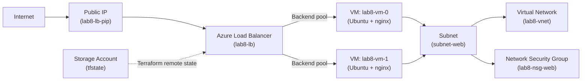
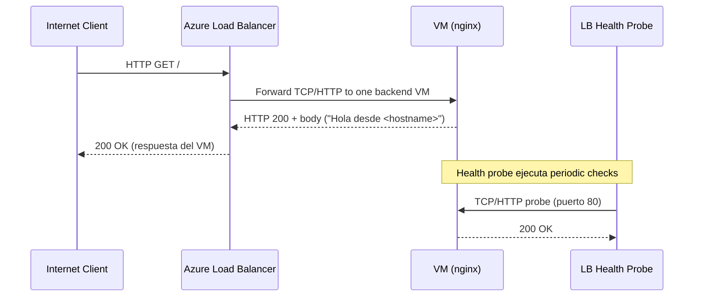

# Lab #8 — Infraestructura como Código con Terraform (Azure)

**Curso:** BluePrints / ARSW  
**Equipo:** Cristian Silva · David Salamanca · Felipe Calvache · Juan Miguel Rojas  
**Repositorio:** https://github.com/fecg2212/ARSW-Lab08

---

## Descripción

Modernización del laboratorio de balanceo de carga en Azure usando **Terraform** para definir, aprovisionar y versionar la infraestructura de la aplicación **Blueprints RT** — una plataforma colaborativa de dibujo en tiempo real. Se desplegó una arquitectura de alta disponibilidad con Load Balancer L4 y 2 VMs Linux en Azure, siguiendo buenas prácticas de IaC.

---

## Arquitectura Desplegada

| Recurso | Nombre | Descripción |
|---|---|---|
| Resource Group | `rg-lab8` | Contenedor de todos los recursos |
| Virtual Network | `lab8-vnet` | Red `10.0.0.0/16` |
| Subnet | `subnet-web` | Subred `10.0.1.0/24` para las VMs |
| Network Security Group | `lab8-nsg-web` | Permite HTTP (80) desde Internet y SSH (22) solo desde IP del equipo |
| Load Balancer | `lab8-lb` | LB público Standard con health probe HTTP |
| Public IP | `lab8-lb-pip` | IP pública estática del LB |
| VM 0 | `lab8-vm-0` | Ubuntu 22.04 LTS · Standard_B1s · nginx |
| VM 1 | `lab8-vm-1` | Ubuntu 22.04 LTS · Standard_B1s · nginx |
| Storage Account | `sttfstate7436` | Backend remoto del estado de Terraform |

**Región de infraestructura:** `canadacentral`  
**Región del estado remoto:** `brazilsouth`  
**IP pública del Load Balancer:** `4.204.193.185`

---

## Diagramas

### Diagrama de Componentes



Explicación: El tráfico entrante desde Internet se enfrenta a la IP pública asociada al Load Balancer (`lab8-lb-pip`). El LB distribuye conexiones TCP/HTTP al `backend pool` compuesto por las VMs (`lab8-vm-0`, `lab8-vm-1`) ubicadas en la subred `subnet-web`. El `Network Security Group` aplica reglas mínimas: HTTP(80) desde Internet hacia el LB y SSH(22) solo desde la IP autorizada. El `Storage Account` aloja el estado remoto de Terraform (blob container) con locking.

### Diagrama de Secuencia



Explicación: Un cliente hace peticiones a la IP pública del LB; el LB enruta la conexión a una de las VMs del backend pool. Cada VM atiende la petición con nginx y devuelve una página simple que incluye su `hostname`. El Load Balancer usa probes de salud periódicos para decidir la disponibilidad de cada VM y excluir temporalmente instancias no saludables del pool.

---

## Estructura del Repositorio

```
.
├── infra/
│   ├── main.tf               # Orquestación de módulos
│   ├── providers.tf          # Provider AzureRM + backend remoto
│   ├── variables.tf          # Declaración de variables
│   ├── outputs.tf            # Outputs: IP del LB, nombres de VMs
│   ├── backend.hcl           # Configuración del estado remoto (sin secretos)
│   ├── backend.hcl.example   # Plantilla del backend
│   ├── cloud-init.yaml       # Script de arranque de las VMs (instala nginx)
│   └── env/
│       └── dev.tfvars        # Variables del ambiente dev
├── modules/
│   ├── vnet/                 # Módulo: Red virtual + NSG + Subnet
│   ├── lb/                   # Módulo: Load Balancer + IP pública + reglas
│   └── compute/              # Módulo: VMs + NICs + asociación al backend pool
└── .github/
    └── workflows/
        └── terraform.yml     # Pipeline CI/CD con GitHub Actions
```

---

## Requisitos Previos

- Azure CLI (`az`) >= 2.78
- Terraform >= 1.6
- Cuenta Azure (Azure for Students o equivalente)
- SSH key RSA generada (`ssh-keygen -t rsa -b 4096`)
- Cuenta GitHub

---

## Bootstrap del Backend Remoto

Antes de usar Terraform, se crearon los recursos para el estado remoto:

```bash
LOCATION=brazilsouth
RG=rg-tfstate-lab8
STO=sttfstate7436
CONTAINER=tfstate

az group create -n $RG -l $LOCATION
az storage account create -g $RG -n $STO -l $LOCATION --sku Standard_LRS --encryption-services blob
az storage container create --name $CONTAINER --account-name $STO --auth-mode login
```

> **Nota:** Se usó `brazilsouth` para el estado remoto porque fue la única región disponible para Storage Accounts en la suscripción de estudiantes.

---

## Flujo de Trabajo Local

```bash
cd infra

# Autenticación
az login

# Inicializar con backend remoto
terraform init -backend-config=backend.hcl

# Revisar formato y validar
terraform fmt -recursive
terraform validate

# Planificar
terraform plan -var-file=env/dev.tfvars -out plan.tfplan

# Aplicar
terraform apply "plan.tfplan"

# Verificar el LB
curl http://$(terraform output -raw lb_public_ip)
```

---

## Evidencias del Despliegue

### Apply exitoso


```
Apply complete! Resources: 16 added, 0 changed, 0 destroyed.

Outputs:
lb_public_ip        = "4.204.193.185"
resource_group_name = "rg-lab8"
vm_names = [
  "lab8-vm-0",
  "lab8-vm-1",
]
```

### Load Balancer distribuyendo tráfico entre las 2 VMs


```bash
$ curl http://4.204.193.185
Hola desde lab8-vm-0

$ curl http://4.204.193.185
Hola desde lab8-vm-0

$ curl http://4.204.193.185
Hola desde lab8-vm-1
```

### GitHub Actions — Pipeline verde


---

## CI/CD con GitHub Actions

El pipeline `.github/workflows/terraform.yml` se ejecuta en cada `push` o `pull_request` a `main` y realiza:

1. **Terraform Format Check** — valida el formato del código
2. **Terraform Validate** — valida la sintaxis y configuración
3. **Terraform Plan** — genera el plan (requiere credenciales OIDC)
4. **Terraform Apply** — ejecución manual vía `workflow_dispatch`
5. **Terraform Destroy** — destrucción manual vía `workflow_dispatch`

> **Nota sobre OIDC:** La configuración completa de autenticación OIDC (federación de identidad entre GitHub y Azure mediante App Registration) requiere permisos de administrador en el tenant de Azure AD, los cuales no están disponibles en suscripciones Azure for Students. El workflow está correctamente implementado y los pasos de `fmt` y `validate` corren exitosamente en cada push.

---

## Variables Principales

| Variable | Descripción | Valor en dev |
|---|---|---|
| `prefix` | Prefijo para nombres de recursos | `lab8` |
| `location` | Región de Azure | `canadacentral` |
| `vm_count` | Número de VMs | `2` |
| `admin_username` | Usuario admin de las VMs | `student` |
| `ssh_public_key` | Ruta a la llave pública RSA | `~/.ssh/id_rsa_lab8.pub` |
| `allow_ssh_from_cidr` | IP autorizada para SSH | `X.X.X.X/32` |

---

## Cloud-Init de las VMs

```yaml
#cloud-config
package_update: true
packages:
  - nginx
  - nodejs
  - npm
runcmd:
  - echo "Hola desde $(hostname)" > /var/www/html/index.nginx-debian.html
  - systemctl enable nginx
  - systemctl restart nginx
```

---

## Reflexión Técnica

### Decisiones de Diseño

**¿Por qué Load Balancer L4 y no Application Gateway L7?**  
Se eligió el Load Balancer estándar de Azure (L4) porque la aplicación Blueprints RT usa WebSockets (Socket.IO) para comunicación en tiempo real. El LB L4 maneja conexiones TCP de forma transparente, lo que permite que los WebSockets funcionen sin configuración adicional. Un Application Gateway L7 requeriría configuración específica para WebSockets y añadiría latencia innecesaria para esta arquitectura.

**Módulos de Terraform**  
Se separó la infraestructura en tres módulos (`vnet`, `lb`, `compute`) para lograr reutilización y separación de responsabilidades. Esto permite, por ejemplo, escalar el número de VMs cambiando solo la variable `vm_count` sin tocar la red o el LB.

**Estado remoto con locking**  
El estado se almacena en Azure Blob Storage con locking automático, lo que previene modificaciones simultáneas por múltiples miembros del equipo.

### Trade-offs

| Decisión | Ventaja | Costo |
|---|---|---|
| LB L4 vs Application Gateway | Soporte nativo de WebSockets, menor costo | Sin path-based routing ni terminación TLS en el LB |
| `Standard_B1s` en canadacentral | Disponible y económico | La región `brazilsouth` (más cercana) no tenía SKUs disponibles |
| Almacenamiento en memoria en la app | Simplicidad | Las 2 VMs tienen datos independientes; sin sticky sessions, un usuario puede perder su sesión |
| Sin IP pública en las VMs | Mayor seguridad | Acceso SSH solo posible desde el NSG con IP autorizada |

### Implicaciones de Seguridad

- El puerto **22/TCP** está restringido solo a la IP del equipo definida en `allow_ssh_from_cidr`. En producción se reemplazaría por **Azure Bastion** para eliminar completamente la exposición de SSH.
- Las VMs no tienen IP pública, solo el Load Balancer la expone.
- El NSG permite solo HTTP (80) desde Internet y SSH (22) desde una IP específica.

### Estimación de Costos

| Recurso | Costo aproximado/mes |
|---|---|
| 2x Standard_B1s | ~$15 USD |
| Load Balancer Standard | ~$18 USD |
| Public IP Standard | ~$3 USD |
| Storage Account (estado) | < $1 USD |
| **Total estimado** | **~$37 USD/mes** |

> Para un entorno de producción real se recomendaría usar **VM Scale Sets** con autoscaling para optimizar costos según la demanda.

### Mejoras para Producción

1. **Persistencia de datos:** Reemplazar el store en memoria por Redis o MongoDB para que todas las VMs compartan el estado.
2. **Autoscaling:** Migrar a VM Scale Sets con reglas de escalado según CPU/conexiones.
3. **Observabilidad:** Agregar Azure Monitor con alertas sobre el health probe y métricas de las VMs.
4. **TLS:** Agregar Application Gateway con certificado SSL para HTTPS.
5. **CI/CD completo:** Configurar OIDC con una cuenta con permisos de administrador en Entra ID.
6. **Azure Bastion:** Eliminar el acceso SSH directo.

### Destrucción Segura

```bash
terraform destroy -var-file=env/dev.tfvars
```

> Verificar que todos los recursos hayan sido eliminados en el portal de Azure para evitar costos innecesarios. Los recursos están etiquetados con `expires = "2026-06-01"` para facilitar el seguimiento.

---


## Referencias

- [Terraform AzureRM Provider](https://registry.terraform.io/providers/hashicorp/azurerm/latest/docs)
- [Azure Load Balancer](https://learn.microsoft.com/azure/load-balancer/)
- [Terraform Backend Azure](https://developer.hashicorp.com/terraform/language/settings/backends/azurerm)
- [GitHub Actions OIDC con Azure](https://docs.github.com/actions/deployment/security-hardening-your-deployments/configuring-openid-connect-in-azure)